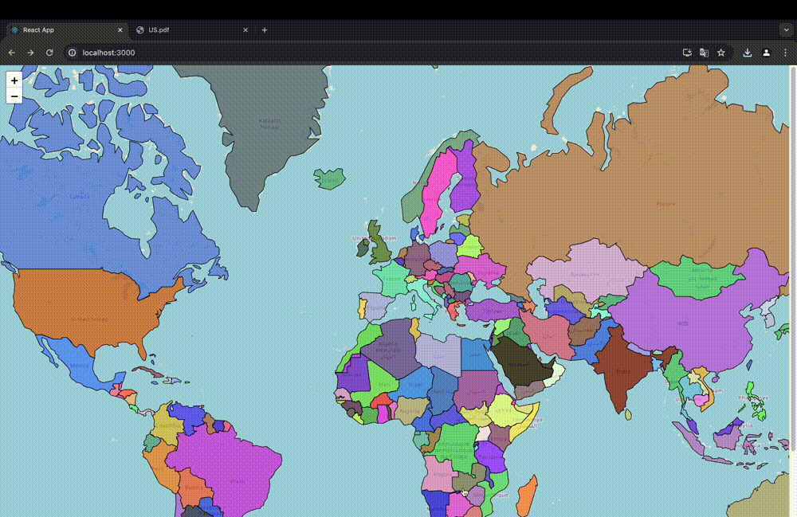

# COVID-19 React & Redux - Redux Saga Project

An application where, when a specific country is clicked on a world map, information such as confirmed COVID-19 cases, deaths, recovered cases, and the date of last update are displayed along with the country details on another screen.

## Application


## Installation

Use the package manager [npm](https://www.npmjs.com) to install node modules.

```bash
cd Frontend
npm install 
```
## Docker

```bash
docker-compose up --build
```

## Utility
- The application utilizes the OpenAPI provided by https://rapidapi.com/axisbits-axisbits-default/api/covid-19-statistics/ as its API.
- The front-end is developed using the Leaflet and PrimeReact libraries, while the React-Redux-Saga framework is utilized for development.


## Docker

```bash
docker build -t covid19-react-app . 
docker run -p 3000:8080 covid19-react-app
```

## Usage

```text
## Running the Application

To run the application, execute the following command:

docker build -t covid19-react-app . 
docker run -p 3000:3000 covid19-react-app

```
- Upon completion of the build, navigate to localhost:3000 in your web browser.
- A world map will be displayed, and when countries colored on the map are clicked, information about the respective country will be shown in tabular form. 
- Additionally, the data can be exported as PDF or XLS formats.
## Contributing

Pull requests are welcome. For major changes, please open an issue first
to discuss what you would like to change.

Please make sure to update tests as appropriate.


## Stay in touch

- Author - [Melis Keşen](https://www.linkedin.com/in/meliskesen/)
- Website - [https://melis-kesen.github.io/Portfolio/](https://melis-kesen.github.io/Portfolio/)

## License


```

## Contributing

Pull requests are welcome. For major changes, please open an issue first
to discuss what you would like to change.

Please make sure to update tests as appropriate.


## Stay in touch

- Author - [Melis Keşen](https://www.linkedin.com/in/meliskesen/)
- Website - [https://melis-kesen.github.io/Portfolio/](https://melis-kesen.github.io/Portfolio/)

## License
